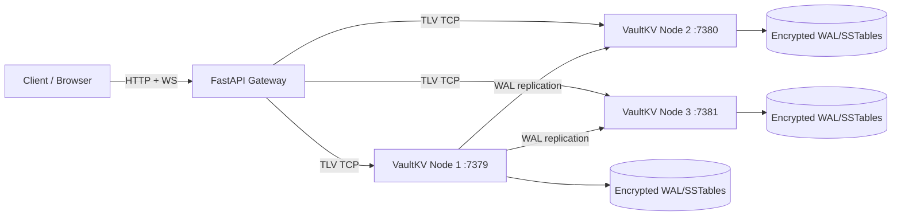

# VaultKV

VaultKV is a distributed key-value system with a full-stack control plane:

- C++17 storage engine (`epoll`, TLV protocol, WAL, replication)
- FastAPI gateway (REST + WebSocket metrics stream)
- React observability console (dashboard, explorer, consensus demo, architecture trace)
- Dockerized 5-service runtime (3 nodes + gateway + frontend)

Last updated: 2026-03-19

## Current Frontend Capabilities

- Landing experience + tabbed control plane
- Overview dashboard with live throughput and cluster metrics
- Key Explorer (`GET`, `SET`, `DEL`, `SCAN`)
- Raft failover simulation (kill/restart nodes)
- Architecture page with a **live request trace runner** (not static text)
- Notification center wired to real app events:
  - gateway connection changes
  - node health transitions
  - leader changes
  - quorum loss/restore
- Floating mini throughput graph on non-overview tabs (minimize/expand + corner switching)

## Live Deployment (Current)

- Frontend: [https://vault-vk.vercel.app](https://vault-vk.vercel.app)
- Backend gateway: [https://80.225.207.59.nip.io](https://80.225.207.59.nip.io)
- Health: [https://80.225.207.59.nip.io/health](https://80.225.207.59.nip.io/health)
- Cluster snapshot: [https://80.225.207.59.nip.io/api/cluster](https://80.225.207.59.nip.io/api/cluster)
- OpenAPI docs: [https://80.225.207.59.nip.io/docs](https://80.225.207.59.nip.io/docs)

## Architecture



## Quick Start (Full Stack via Docker)

```bash
docker compose up -d --build
```

Endpoints:

- Frontend: `http://localhost:3000`
- Gateway docs: `http://localhost:8000/docs`
- Health: `http://localhost:8000/health`
- Cluster: `http://localhost:8000/api/cluster`

Stop:

```bash
docker compose down -v
```

## Local Development

### 1) Engine (native)

```bash
cmake -S . -B build -DCMAKE_BUILD_TYPE=Release
cmake --build build -j
ctest --test-dir build --output-on-failure
```

### 2) Gateway (Python)

```bash
cd gateway
python -m venv .venv
# Windows: .venv\Scripts\activate
# Linux/macOS: source .venv/bin/activate
pip install -r requirements.txt
uvicorn main:app --host 0.0.0.0 --port 8000
```

### 3) Frontend (Vite)

```bash
cd frontend
npm install
npm run dev
```

Optional frontend env:

- `VITE_API_BASE_URL=https://<gateway-domain>`
- `VITE_WS_BASE_URL=wss://<gateway-domain>`

## Gateway API Surface

- `GET /health`
- `POST /api/keys`
- `GET /api/keys/{key}`
- `DELETE /api/keys/{key}`
- `GET /api/keys?prefix=<prefix>&limit=<n>`
- `GET /api/cluster`
- `POST /api/nodes/{node_id}/kill`
- `POST /api/nodes/{node_id}/restart`
- `WS /ws/metrics`

## Verification Scripts

Linux/macOS:

```bash
bash scripts/verify_all.sh
```

Windows:

```powershell
powershell -ExecutionPolicy Bypass -File scripts\verify_all.ps1
```

## Deployment

Primary documented path:

- Vercel frontend + external backend: [DEPLOY_VERCEL.md](DEPLOY_VERCEL.md)

Important for Vercel:

- Set project root directory to `frontend`
- Configure `VITE_API_BASE_URL` (and optional `VITE_WS_BASE_URL`)

## Documentation

- Architecture notes: [ARCHITECTURE.md](ARCHITECTURE.md)
- Vercel deployment guide: [DEPLOY_VERCEL.md](DEPLOY_VERCEL.md)

## Troubleshooting

### Vercel shows `404: NOT_FOUND`

Set the Vercel project root directory to `frontend`, then redeploy.

### `GET` returns `key not found`

Write the key first with `SET`, then read the same key.

### Windows curl TLS revocation issue

```powershell
curl.exe --ssl-no-revoke https://<url>
```

## Repository Layout

```text
vaultVK/
  include/vaultkv/          # C++ public headers
  src/                      # C++ engine
  tests/                    # C++ tests
  gateway/                  # FastAPI gateway + TLV bridge
  frontend/                 # React control plane
  scripts/                  # Verification scripts
  .github/workflows/ci.yml  # CI pipeline
```

