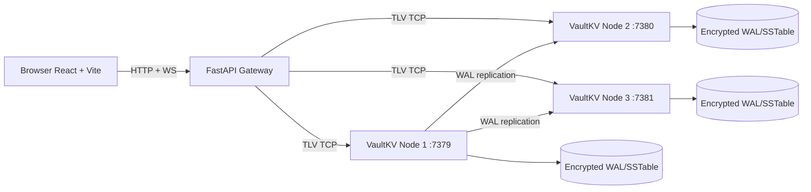

# VaultKV

<p align="center">
  
</p>

<p align="center">
  <a href="https://github.com/Flamki/vaultVK/actions/workflows/ci.yml"></a>
  
  
  
  
  
</p>

VaultKV is a production-style distributed key-value storage system with a complete full-stack demo layer:

- C++17 storage engine (`epoll`, TLV protocol, WAL, MemTable, SSTable, compaction)
- FastAPI gateway translating TLV to REST + WebSocket
- React control plane with live charts and cluster actions
- Dockerized 5-service stack (3 nodes + gateway + frontend)

## Phase 2 Highlights

- Live ops/sec chart (500ms stream) via WebSocket
- Per-node health cards (latency, lag, role, ops)
- Key Explorer (`GET`, `SET`, `DEL`, `SCAN`) with history
- Raft-style failover demo (`kill` / `restart` node from UI)
- Expanded CI: native build + ASAN + TSAN + UBSAN + docker smoke + frontend build

## Architecture



## Quick Start (Full Stack)

```bash
docker compose up -d --build
```

Open:

- Frontend dashboard: `http://localhost:3000`
- Gateway API docs: `http://localhost:8000/docs`
- Gateway cluster snapshot: `http://localhost:8000/api/cluster`

Shutdown:

```bash
docker compose down -v
```

## Local Native Build (Engine)

```bash
cmake -S . -B build -DCMAKE_BUILD_TYPE=Release
cmake --build build -j
ctest --test-dir build --output-on-failure
```

## Verification Scripts

Linux/macOS:

```bash
bash scripts/verify_all.sh
```

Windows PowerShell:

```powershell
powershell -ExecutionPolicy Bypass -File scripts\verify_all.ps1
```

These run build/test, launch all services, execute quorum demo, validate gateway + frontend health, and teardown.

## Vercel Deployment (Frontend + External Backend)

Vercel hosts the React frontend. The 3-node C++ cluster + FastAPI gateway should run on a Linux container host.

1. Deploy backend stack first (Docker host) and expose gateway over HTTPS, for example:
   - `https://gateway.yourdomain.com/api/*`
   - `wss://gateway.yourdomain.com/ws/*`
2. In Vercel, import this repo and set **Root Directory** to `frontend`.
3. Configure environment variables in Vercel project settings:
   - `VITE_API_BASE_URL=https://gateway.yourdomain.com`
   - `VITE_WS_BASE_URL=wss://gateway.yourdomain.com` (optional)
4. Deploy.

Included files for this flow:
- `frontend/vercel.json` (SPA rewrite to `index.html`)
- `frontend/.env.example` (required env template)
- `frontend/src/lib/runtimeConfig.ts` (env-aware API/WS routing)
- `DEPLOY_VERCEL.md` (full deployment checklist)

Important:
- Backend endpoint must be HTTPS for browser mixed-content safety.
- Gateway CORS is open by default in Phase 2 (`allow_origins=["*"]`).

## Quorum Demo

Linux/macOS:

```bash
bash scripts/quorum_demo.sh
```

Windows PowerShell:

```powershell
powershell -ExecutionPolicy Bypass -File scripts\quorum_demo.ps1
```

Python (CI-friendly):

```bash
python3 scripts/quorum_demo.py
```

## Repository Layout

```text
vaultVK/
  include/vaultkv/          # C++ public headers
  src/                      # C++ core engine
  tests/                    # C++ tests
  gateway/                  # FastAPI TLV bridge
  frontend/                 # React control plane
  nginx/                    # Reverse proxy for API + WS
  scripts/                  # Verification and demo scripts
  .github/workflows/ci.yml  # 6-job CI pipeline
```

## CI Pipeline

`.github/workflows/ci.yml` includes:

- `native-build` (release build + tests + benchmark smoke)
- `asan` (address sanitizer)
- `tsan` (thread sanitizer)
- `ubsan` (undefined behavior sanitizer)
- `docker-cluster` (full stack + quorum + gateway smoke)
- `frontend-build` (npm ci + typecheck + production build)

## Design Notes

- `epoll` is used for scalable non-blocking IO in the C++ server.
- WAL-first writes protect durability before MemTable apply.
- FastAPI isolates browser concerns from TLV binary framing.
- WebSocket stream avoids polling jitter in dashboard charts.
- Failover controls are intentionally demo-focused for interview storytelling.

## Platform Notes

- C++ server runtime is Linux-first (`epoll`).
- On non-Linux hosts, use Docker for complete Phase 2 behavior.
- If host OpenSSL dev libs are missing, host-native build uses a development fallback cipher; Docker runtime uses OpenSSL in Linux containers.
