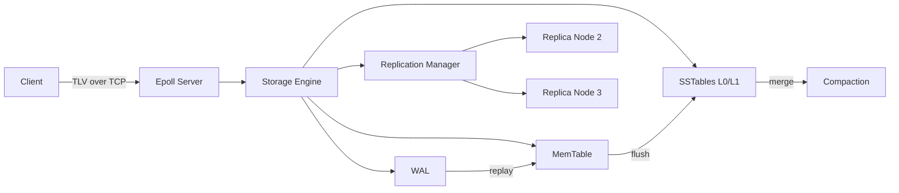

# VaultKV

<p align="center">
  
</p>

<p align="center">
  <a href="https://github.com/Flamki/vaultVK/actions/workflows/ci.yml"></a>
  
  
  
  
</p>

VaultKV is a production-style distributed key-value storage engine focused on low-level systems design:

- `epoll`-driven binary TCP server (TLV wire protocol)
- Encrypted WAL (`mmap` path + integrity checks)
- MemTable + immutable SSTable persistence
- Bloom-indexed lookup and levelled compaction
- Multi-node replication with quorum write behavior

## Quick Start

```bash
cmake -S . -B build -DCMAKE_BUILD_TYPE=Release
cmake --build build -j
ctest --test-dir build --output-on-failure
```

Run local server:

```bash
./build/vaultkv-server --data-dir ./data --port 7379
```

## Architecture



## Feature Matrix

| Layer | What is implemented |
|---|---|
| Network | TLV parser, partial-frame buffering, request dispatch |
| Durability | WAL append/replay with CRC validation |
| Crypto | OpenSSL AES path + dev fallback when unavailable |
| Storage | MemTable + SSTable reader/writer + bloom filter |
| Maintenance | Levelled `L0 -> L1` compaction |
| Distributed | Peer fan-out replication + quorum acknowledgment |
| Operations | CLI client, inspector tool, benchmark binary, scripts |

## Docker 3-Node Cluster

```bash
docker compose up -d --build
```

Endpoints:
- Leader: `127.0.0.1:7379`
- Follower: `127.0.0.1:7380`
- Follower: `127.0.0.1:7381`

Run quorum demo:

```bash
bash scripts/quorum_demo.sh
```

PowerShell:

```powershell
powershell -ExecutionPolicy Bypass -File scripts\quorum_demo.ps1
```

Stop:

```bash
docker compose down -v
```

## Full Verification

Linux/macOS:

```bash
bash scripts/verify_all.sh
```

Windows PowerShell:

```powershell
powershell -ExecutionPolicy Bypass -File scripts\verify_all.ps1
```

This runs build, tests, cluster startup, quorum demo, and teardown.

## CI

GitHub Actions workflow: `.github/workflows/ci.yml`

- Native Linux build + test
- Docker cluster smoke test + quorum demo

## Project Layout

```text
vaultkv/
  include/vaultkv/        # public interfaces
  src/                    # core implementation
  tests/                  # unit/integration tests
  tools/                  # CLI and SSTable inspection
  bench/                  # benchmark executable
  scripts/                # automation and demos
```

## Design Choices

- `epoll` for scalable event-driven socket handling
- WAL-before-apply for crash recovery guarantees
- SSTable immutability for predictable compaction mechanics
- Quorum writes for stronger distributed durability semantics

## Platform Notes

- Server runtime is Linux-first (`epoll`).
- On non-Linux hosts, you can still build/test core library and run full distributed demo via Docker.
- If OpenSSL is not installed on the host, a development-only fallback cipher is used outside containers.
