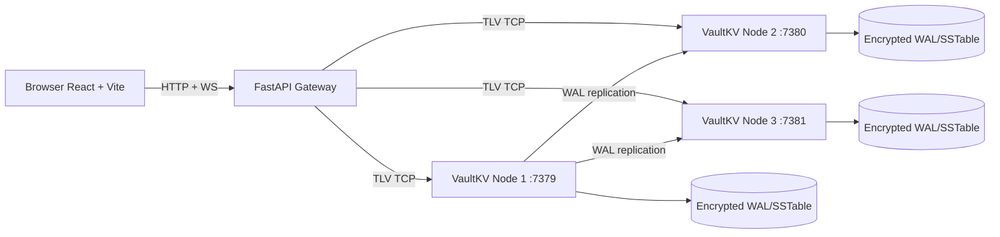

# VaultKV

<p align="center">
  
</p>

<p align="center">
  <a href="https://github.com/Flamki/vaultVK/actions/workflows/ci.yml"></a>
  
  
  
  
  
</p>

VaultKV is a distributed key-value system with a complete full-stack control plane:

- C++17 engine (`epoll`, TLV protocol, WAL, MemTable, SSTable, compaction)
- FastAPI gateway (TLV-to-REST + WebSocket metrics stream)
- React dashboard (ops charts, key explorer, failover controls)
- Dockerized 5-service runtime (3 data nodes + gateway + frontend)

## Live Deployment (Current)

- Frontend: [https://vault-vk.vercel.app](https://vault-vk.vercel.app)
- Backend gateway: [https://80.225.207.59.nip.io](https://80.225.207.59.nip.io)
- Health check: [https://80.225.207.59.nip.io/health](https://80.225.207.59.nip.io/health)
- Cluster snapshot: [https://80.225.207.59.nip.io/api/cluster](https://80.225.207.59.nip.io/api/cluster)
- Gateway OpenAPI docs: [https://80.225.207.59.nip.io/docs](https://80.225.207.59.nip.io/docs)

## Documentation Links

- Architecture notes: [ARCHITECTURE.md](ARCHITECTURE.md)
- Vercel deployment: [DEPLOY_VERCEL.md](DEPLOY_VERCEL.md)
- Oracle backend deployment: [DEPLOY_ORACLE.md](DEPLOY_ORACLE.md)
- Render trial deployment: [DEPLOY_RENDER.md](DEPLOY_RENDER.md)

## Architecture



## Local Full Stack (Docker)

Start:

```bash
docker compose up -d --build
```

Endpoints:

- Frontend: `http://localhost:3000`
- Gateway docs: `http://localhost:8000/docs`
- Cluster snapshot: `http://localhost:8000/api/cluster`

Stop:

```bash
docker compose down -v
```

## Native Engine Build

```bash
cmake -S . -B build -DCMAKE_BUILD_TYPE=Release
cmake --build build -j
ctest --test-dir build --output-on-failure
```

## Verification Scripts

Linux/macOS:

```bash
bash scripts/verify_all.sh
```

Windows:

```powershell
powershell -ExecutionPolicy Bypass -File scripts\verify_all.ps1
```

These run configure/build/tests, launch all services, execute quorum replication demo, verify gateway/frontend health, then teardown.

## Deployment Options

### Vercel Frontend + External Backend

- Guide: [DEPLOY_VERCEL.md](DEPLOY_VERCEL.md)
- Required Vercel root directory: `frontend`
- Required env vars:
  - `VITE_API_BASE_URL=https://<backend-domain>`
  - `VITE_WS_BASE_URL=wss://<backend-domain>` (optional)

### Oracle Always Free Backend (Recommended)

- Guide: [DEPLOY_ORACLE.md](DEPLOY_ORACLE.md)
- Deployment assets:
  - [`deploy/oracle/docker-compose.oracle.yml`](deploy/oracle/docker-compose.oracle.yml)
  - [`deploy/oracle/Caddyfile`](deploy/oracle/Caddyfile)
  - [`deploy/oracle/.env.example`](deploy/oracle/.env.example)
- Helper scripts:
  - [`scripts/oracle_bootstrap.sh`](scripts/oracle_bootstrap.sh)
  - [`scripts/oracle_deploy.sh`](scripts/oracle_deploy.sh)

### Render Trial Backend

- Guide: [DEPLOY_RENDER.md](DEPLOY_RENDER.md)
- Blueprint: [render.yaml](render.yaml)
- Note: private services are required for nodes (trial credits needed).

## Quorum Demo

Linux/macOS:

```bash
bash scripts/quorum_demo.sh
```

Windows:

```powershell
powershell -ExecutionPolicy Bypass -File scripts\quorum_demo.ps1
```

Python:

```bash
python3 scripts/quorum_demo.py
```

## Live API Smoke Test (Copy/Paste)

Use this against the current backend:

```bash
curl -s https://80.225.207.59.nip.io/health
curl -s -X POST https://80.225.207.59.nip.io/api/keys -H "content-type: application/json" -d "{\"key\":\"hello\",\"value\":\"world\"}"
curl -s "https://80.225.207.59.nip.io/api/keys/hello"
curl -s "https://80.225.207.59.nip.io/api/scan?prefix=h&limit=10"
```

Windows `curl` TLS note:

```powershell
curl.exe --ssl-no-revoke https://80.225.207.59.nip.io/health
```

## Troubleshooting

### `GET` shows `key not found`

This is expected when the key has not been written yet. Use `SET` first, then `GET` the same key.

### Vercel shows `404: NOT_FOUND`

Most common cause: wrong project root.  
Set Vercel project root directory to `frontend`, then redeploy.

### TLS issues on some Windows curl builds

If `curl` fails with revocation checks on Windows Schannel, use:

```powershell
curl.exe --ssl-no-revoke https://<url>
```

## Repository Layout

```text
vaultVK/
  include/vaultkv/          # C++ public headers
  src/                      # C++ core engine
  tests/                    # C++ tests
  gateway/                  # FastAPI TLV bridge
  frontend/                 # React control plane
  nginx/                    # Reverse proxy for API + WS
  scripts/                  # Verification and deployment scripts
  .github/workflows/ci.yml  # Multi-job CI pipeline
```

## CI Pipeline

Workflow: [`.github/workflows/ci.yml`](.github/workflows/ci.yml)

- `native-build`
- `asan`
- `tsan`
- `ubsan`
- `docker-cluster`
- `frontend-build`

## Platform Notes

- C++ server runtime is Linux-first (`epoll`).
- On Windows/macOS, use Docker for complete Phase 2 runtime behavior.
- If host OpenSSL dev libs are missing, host-native build uses development fallback crypto; Linux Docker runtime uses OpenSSL.
